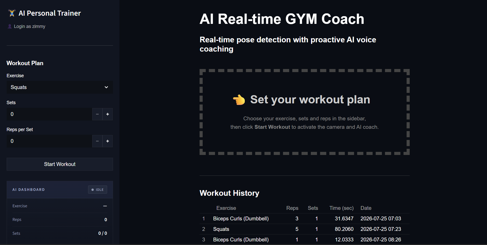
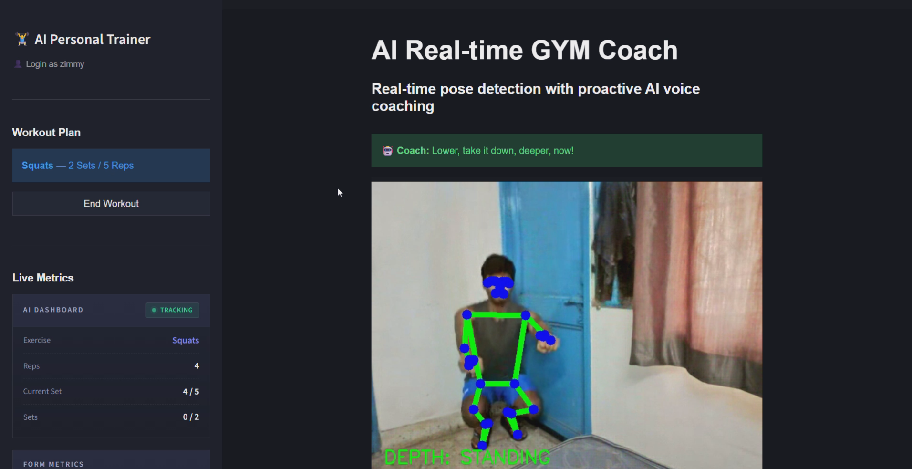
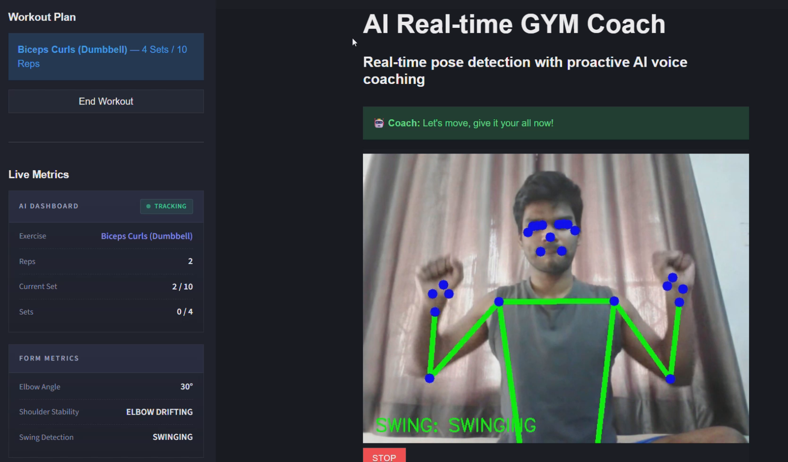
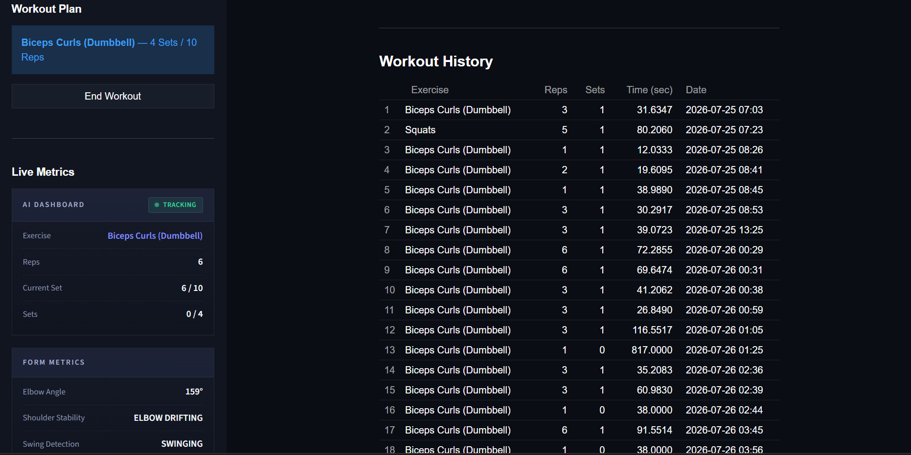
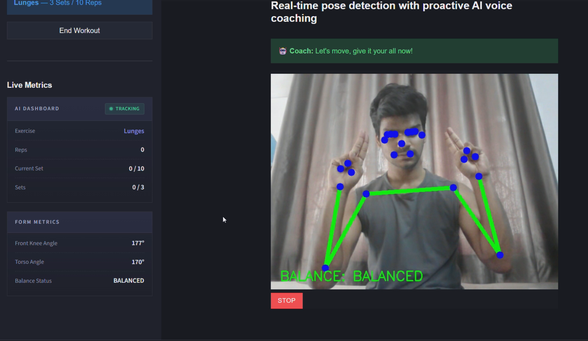

# 🏋️ AI Real-Time Gym Coach

An AI-powered personal fitness trainer that uses computer vision and real-time pose estimation to analyze workout form, count repetitions, and provide instant AI voice coaching.

The goal of this project is to make home workouts smarter by giving users live feedback on their exercise form, tracking workout progress, and delivering an interactive coaching experience.

---

##  Project Preview


<p align="center">

</p>

---


<p align="center">

</p>

---


<p align="center">

</p>

---


<p align="center">

</p>

---


<p align="center">

</p>

---

##  Features

-  Real-time pose detection using MediaPipe
-  Supports multiple exercises
-  Squats
-  Push-ups
-  Biceps Curls
-  Shoulder Press
-  Lunges
-  Automatic repetition counting
-  Live workout dashboard
-  Exercise-specific posture and form correction
-  AI-generated coaching feedback using Groq
-  Natural voice responses using ElevenLabs
-  Simple user login system
-  Workout history tracking with SQLite
-  Modern responsive landing page

---

##  Performance

| Metric | Result |
|---------|---------|
| Inference Latency | **38 ms** |
| Live Processing | **20 FPS** |
| AI Voice Response | **0.91 s** |
| Supported Exercises | **5+** |

> These performance metrics were measured during testing on the development environment. Actual performance may vary depending on hardware and deployment platform.

---

##  Tech Stack

### Frontend

- Streamlit
- HTML5
- CSS3
- JavaScript

### Computer Vision

- MediaPipe Pose Landmarker
- OpenCV
- NumPy

### Backend

- Python
- SQLite

### AI Services

- Groq API
- ElevenLabs API

### Deployment

- Vercel (Landing Page)
- Render (Application)

---

##  Project Structure

```
AI-Real-Time-Gym-Coach
│
├── LandingPage/
│   ├── assets/
│   │   ├── css/
│   │   ├── fonts/
│   │   ├── images/
│   │   └── videos/
│
├── core/
├── detectors/
├── ml_models/
├── services/
├── static/
│
├── main.py
├── requirements.txt
├── data.db
└── README.md
```

---

##  How It Works

1. Login using your name.
2. Select an exercise.
3. Choose the number of sets and repetitions.
4. Start the workout.
5. The webcam detects body landmarks in real time.
6. Exercise-specific algorithms analyze posture and movement.
7. AI provides instant coaching feedback.
8. Workout statistics are automatically recorded and stored.

---

##  Supported Exercises

- Squats
- Push-ups
- Biceps Curls
- Shoulder Press
- Lunges

---

##  Live Demo

### Landing Page

https://ai-real-time-gym-coach.vercel.app/

### Application

https://ai-real-time-gym-coach.onrender.com/

### Demo Video

A complete walkthrough of the project is available in the repository and can also be viewed here:

*https://youtu.be/7Em67EOG6Y0*

---

##  Future Improvements

- Personalized workout plans
- More exercise detection
- User authentication
- Cloud database
- Progress analytics dashboard
- Workout reports
- Mobile application
- Wearable device integration

---

##  Deployment Note

The application runs completely in the local development environment.

The public deployment is hosted on Render's free tier. Since the real-time workout module relies on WebRTC, camera connectivity may occasionally be affected by free hosting limitations and browser/network configurations.

The complete functionality of the application can be seen in the included demo video.

---

##  Author

**Prakash Kumar**

B.Tech — Electronics & Communication Engineering

Thapar Institute of Engineering and Technology

### GitHub

https://github.com/pk612004

### LinkedIn

https://www.linkedin.com/in/prakash612004/

---

If you found this project interesting, consider giving the repository a ⭐.