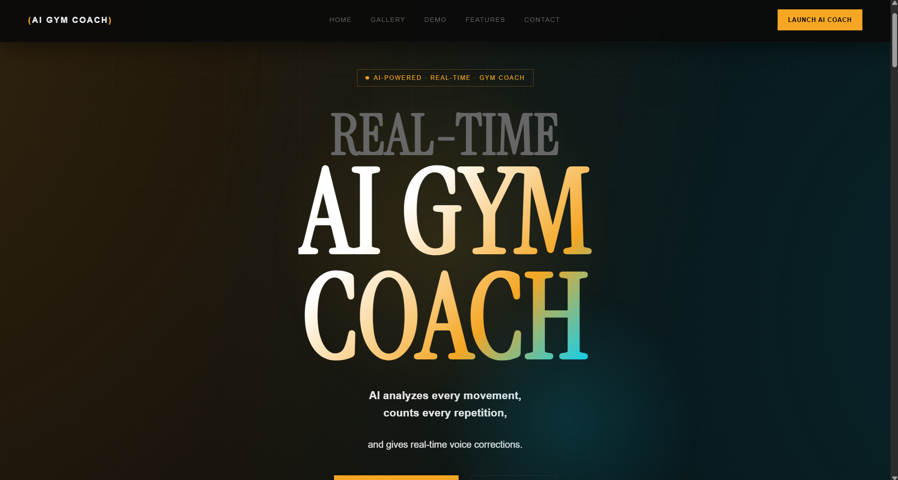
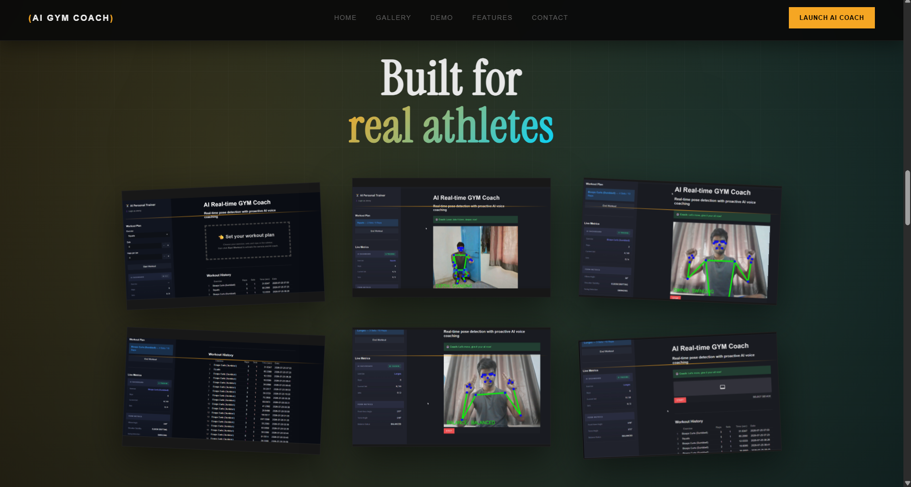

# AI Real-Time Gym Coach

An AI-powered personal fitness trainer that uses computer vision and real-time pose estimation to analyze workout form, count repetitions, and provide instant AI voice coaching.

The goal of this project is to make home workouts smarter by giving users live feedback on their exercise form, tracking workout progress, and delivering an interactive coaching experience.

---

## Live Demo

### Landing Page

https://ai-real-time-gym-coach.vercel.app/

### Application

https://ai-real-time-gym-coach.onrender.com/

### Demo Video

https://youtu.be/7Em67EOG6Y0

---

## Project Preview

<p align="center">
  
  
  
</p>

---

## Features

- Real-time pose detection using MediaPipe
- Supports 5+ exercises
  - Squats
  - Push-ups
  - Biceps Curls
  - Shoulder Press
  - Lunges
- Automatic repetition counting
- Live workout dashboard
- Exercise-specific posture and form correction
- AI-generated coaching feedback using Groq
- Natural voice responses using ElevenLabs
- Simple user login system
- Workout history tracking with SQLite
- Responsive landing page

---

## Performance

| Metric | Result |
|---------|---------|
| Inference Latency | **38 ms** |
| Live Processing | **20 FPS** |
| AI Voice Response | **0.91 s** |
| Supported Exercises | **5+** |

> Performance values were measured during testing on the local development environment.

---

## Tech Stack

### Frontend

- Streamlit
- HTML5
- CSS3
- JavaScript

### Computer Vision

- MediaPipe Pose Landmarker
- OpenCV
- NumPy

### Backend

- Python
- SQLite

### AI Services

- Groq API
- ElevenLabs API

### Deployment

- Vercel (Landing Page)
- Render (Application)

---

## Project Structure

```text
AI-Real-Time-Gym-Coach
│
├── LandingPage/
│   ├── assets/
│   │   ├── css/
│   │   ├── fonts/
│   │   ├── images/
│   │   └── videos/
│
├── core/
├── detectors/
├── ml_models/
├── services/
├── static/
│
├── main.py
├── requirements.txt
├── data.db
└── README.md
```

---

## How It Works

1. Login using your name.
2. Select an exercise.
3. Choose the number of sets and repetitions.
4. Start the workout.
5. The webcam detects body landmarks in real time.
6. Exercise-specific algorithms analyze posture and movement.
7. AI provides instant coaching feedback.
8. Workout statistics are automatically stored in SQLite.

---

## Supported Exercises

- Squats
- Push-ups
- Biceps Curls
- Shoulder Press
- Lunges

---

## Future Improvements

- Personalized workout plans
- Additional exercise support
- User authentication
- Cloud database integration
- Progress analytics
- Workout reports
- Mobile application
- Wearable integration

---

## Deployment Note

The application works fully in the local development environment.

The live demo is hosted on Render's free tier. Since the workout module relies on WebRTC for real-time camera streaming, connectivity may occasionally be affected by browser settings, network configuration, or free hosting limitations.

The complete functionality of the project is demonstrated in the linked demo video.

---

## Author

**Prakash Kumar**

B.Tech – Electronics & Communication Engineering

Thapar Institute of Engineering and Technology

**GitHub**

https://github.com/pk612004

**LinkedIn**

https://www.linkedin.com/in/prakash612004/

---

If you found this project useful or interesting, consider starring the repository.